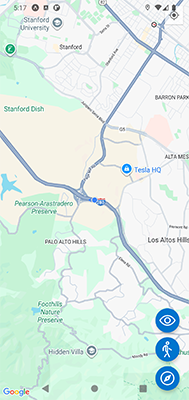
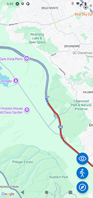

# 📍 Maps App - Expo & React Native

Aplicación desarrollada con **Expo** y **React Native**, en la cual se implementan conceptos clave de permisos, estado de la aplicación y manejo de mapas.

La aplicación cuenta con:

1. Maps
2. Polyline para dibujar el trayecto del usuario
3. 👁️Botón Mostrar/ocultar polyline
4. 🚶‍♀️‍➡️Botón animar cámara de maps
5. 📍Botón reestablecer ubicación del usuario

---

## 🚀 Características principales

- **Expo Location**: obtención de la ubicación del dispositivo.
- **Permisos**: gestión de permisos de acceso a la ubicación.
- **Providers y Acciones**: arquitectura modular para manejar estado y lógica.
- **Zustand**: manejo de estado global de forma sencilla y eficiente.
- **Estado de los permisos**: control dinámico según el acceso otorgado o denegado.
- **AppState**: detección de cambios en el estado de la aplicación.
- **Abrir ajustes**: redirección a configuración en caso de permisos denegados.
- **Reutilización de componentes personalizados**: diseño escalable y mantenible.

---

## 🗺️ Funcionalidades de Mapas

- **Marcadores**: añadir puntos de interés en el mapa.
- **Polylines**: dibujar rutas y trayectorias.
- **Seguimiento de coordenadas**: actualización en tiempo real de la ubicación.
- **Obtener ubicación actual**: acceso inmediato a la posición del usuario.
- **Controlar el mapa**: interacción con zoom, desplazamiento y eventos.
- **Mover cámara**: animación y enfoque dinámico en coordenadas específicas.

---

## 📸 Capturas de pantall


| Map | Polyline   |
| ----- | ------ |
|  |  |


---

## ⚠️ Nota

Para simular el seguimiento del usuario, es recomendable ejecutar la aplicación en un emulador, ya sea Andro o IOS y que el emulador simule una ruta de destino.

***Android***

1. Abrir las herramientas del emulador (barra lateral y presionar en los tres puntos)
2. Click en "Location"
3. Click en tab "Routes"
4. Buscar destino en "Search"
5. Click en el ícono "cómo llegar"
6. Click en el mapa para establecer un origen
7. Click en "PLAY ROUTE" (se puede variar la velocidad de la animación con Playback Speed)

---

## ⚙️Instalación y ejecución

1. Clonar el repositorio

   ```bash
   git clone https://github.com/tu-usuario/tu-repo.git
   ```
2. Instalar dependencias

   ```bash
   npm install
   ```
3. Ejecutar proyecto

   ```bash
   npx expo start
   ```

   ---

## 👨‍💻 Autor

Carlos Ceballez
*Técnico Superior en Programación - UTN*
[linkedin.com/in/carlos-ceballez/](https://linkedin.com/in/carlos-ceballez/)
